# 🌱 RenewCred CMS

A production-ready Content Management System (CMS) built for managing sustainability standards and documentation dynamically. This project was developed as part of the Frontend Engineering Assignment.

The CMS allows administrators to manage standards, versions, and documentation sections while the public website consumes all content dynamically through REST APIs.

---

## 🚀 Features

### 🔐 Authentication
- Admin Login
- Admin Registration
- Logout
- JWT Authentication
- Protected Admin Routes

### 📊 Dashboard
- Total Standards
- Total Versions
- Published Standards
- Draft Standards

### 📄 Standards Management
- Create Standards
- Edit Standards
- Delete Standards
- Publish Status

### 🗂 Version Management
- Create Versions
- Delete Versions
- Release Date Support

### 📝 Documentation Management
- Rich Text Editor (TipTap)
- Create Sections
- Edit Sections
- Delete Sections
- Ordered Documentation

### 🌍 Public Website
- Dynamic Standards List
- Dynamic Documentation Pages
- Version Selection
- Search Sections
- Scroll Spy Navigation
- Copy Section Link

---

# 🛠 Tech Stack

## Frontend
- Next.js (App Router)
- React
- TypeScript
- Tailwind CSS
- Axios
- TipTap Editor
- Lucide React
- React Hot Toast

## Backend
- Express.js
- Node.js
- JWT Authentication
- Bcrypt.js
- Mongoose

## Database
- MongoDB Atlas

---

# 🏗 Architecture

```
Frontend (Next.js)
        │
        │ REST API
        ▼
Backend (Express.js)
        │
        ▼
MongoDB Atlas
```

---

# 📁 Project Structure

```
renewcred-cms/

├── frontend/
│   ├── app/
│   ├── components/
│   ├── lib/
│   └── public/
│
├── backend/
│   ├── controllers/
│   ├── middleware/
│   ├── models/
│   ├── routes/
│   ├── config/
│   └── src/
│
└── README.md
```

---

# ⚙️ Installation

## Clone Repository

```bash
git clone https://github.com/ajaysainath/renewcred-cms.git
```

---

## 🔗 Repository

GitHub Repository:

https://github.com/ajaysainath/renewcred-cms

---

## Backend

```bash
cd backend
npm install
npm run dev
```

Backend runs on:

```
http://localhost:5000
```

---

## Frontend

```bash
cd frontend
npm install
npm run dev
```

Frontend runs on:

```
http://localhost:3000
```

---

# 🔑 Environment Variables

## Backend (.env)

```env
PORT=5000

MONGODB_URI=your_mongodb_connection_string

JWT_SECRET=your_secret_key
```

---

## Frontend (.env.local)

```env
NEXT_PUBLIC_API_URL=http://localhost:5000
```

---

# 📚 API Endpoints

## Authentication

```
POST /api/auth/register

POST /api/auth/login

GET /api/profile
```

---

## Standards

```
GET    /api/standards

GET    /api/standards/:slug

POST   /api/standards

PUT    /api/standards/:id

DELETE /api/standards/:id
```

---

## Versions

```
POST   /api/standards/:slug/version

GET    /api/standards/:slug/version/:versionId

DELETE /api/version/:id
```

---

## Sections

```
POST

PUT

DELETE
```
---
# 🚀 Live Demo

## Public Website

https://renewcred-cms-xi.vercel.app

## Admin Portal

https://renewcred-cms-xi.vercel.app/login

## Backend API

Health Endpoint

https://renewcred-backend-7kwj.onrender.com/api/health

REST Base URL

https://renewcred-backend-7kwj.onrender.com/api

# 🔑 Demo Credentials

Email: ajay@example.com

Password: Password123

---

# 📸 Application Screenshots

## 🌐 Public Website

### Homepage

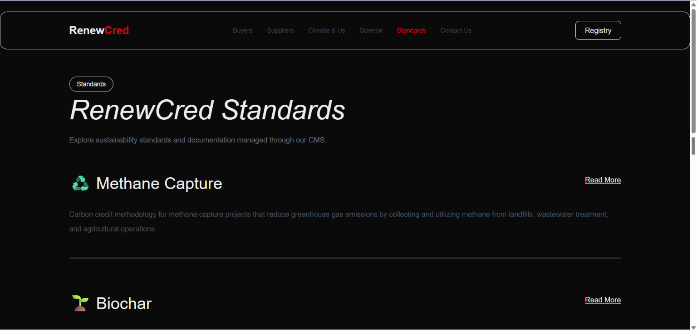
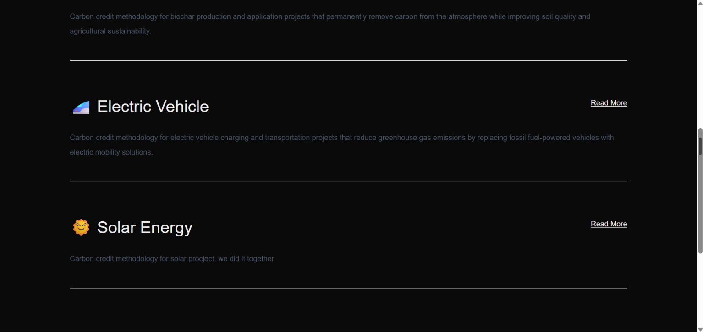
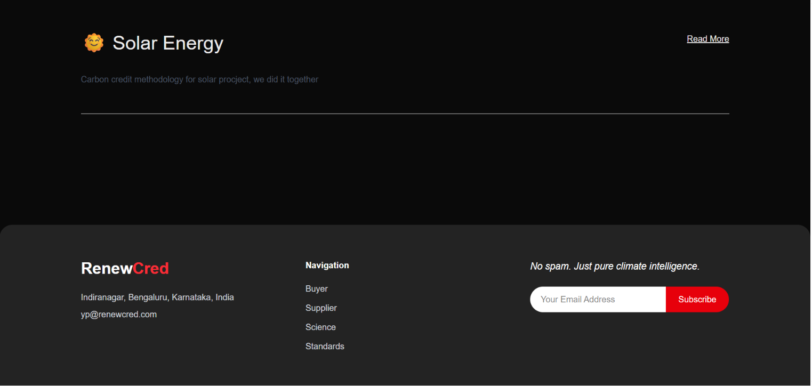

---

### Documentation Page

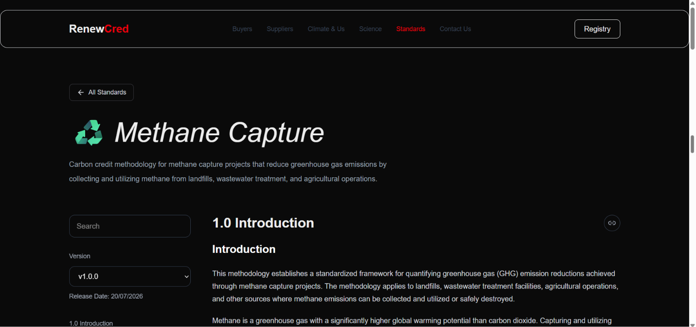
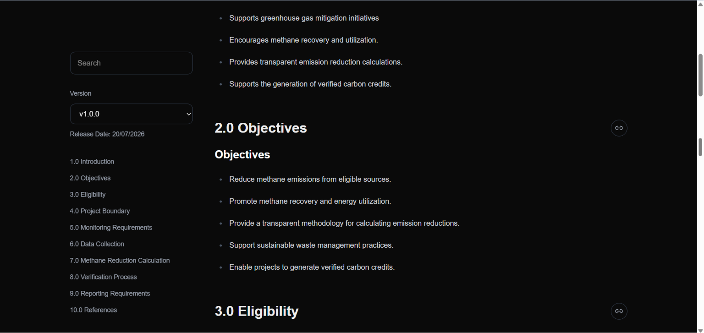
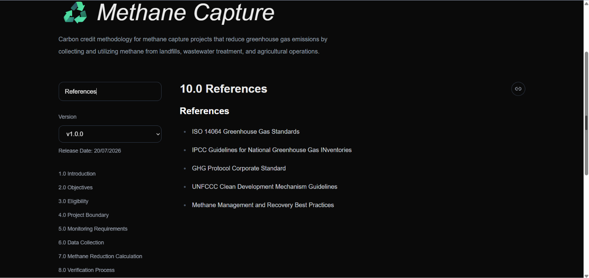
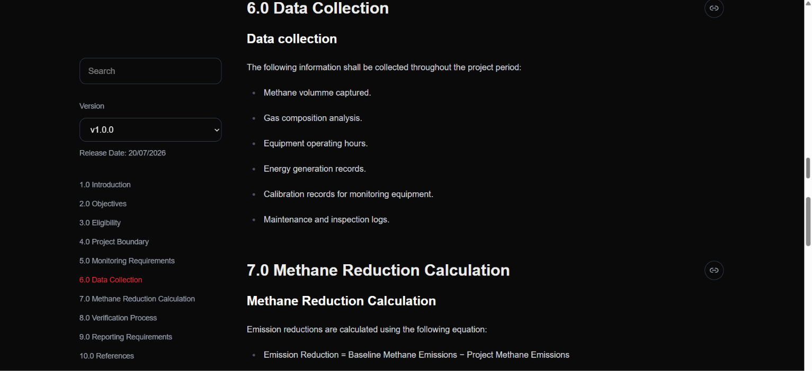
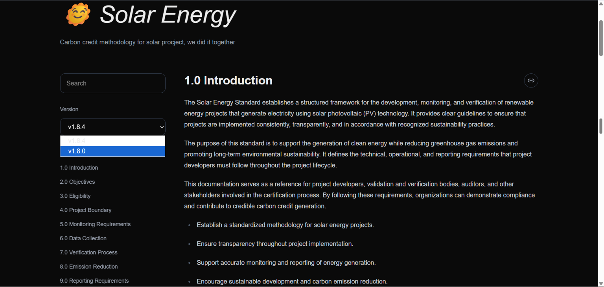

---

## 🔐 Admin CMS

### Login Page

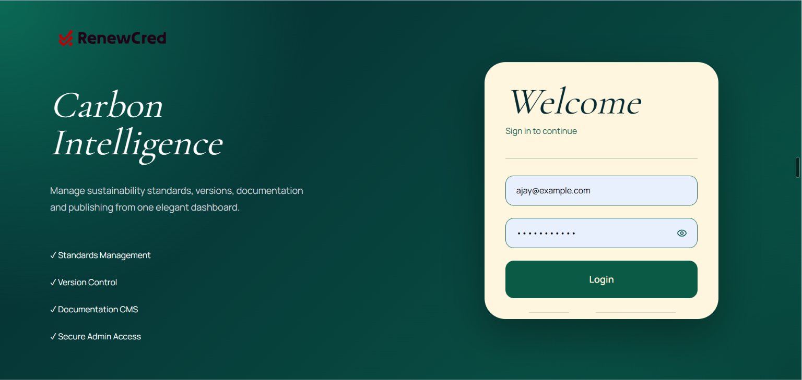

---

### Dashboard

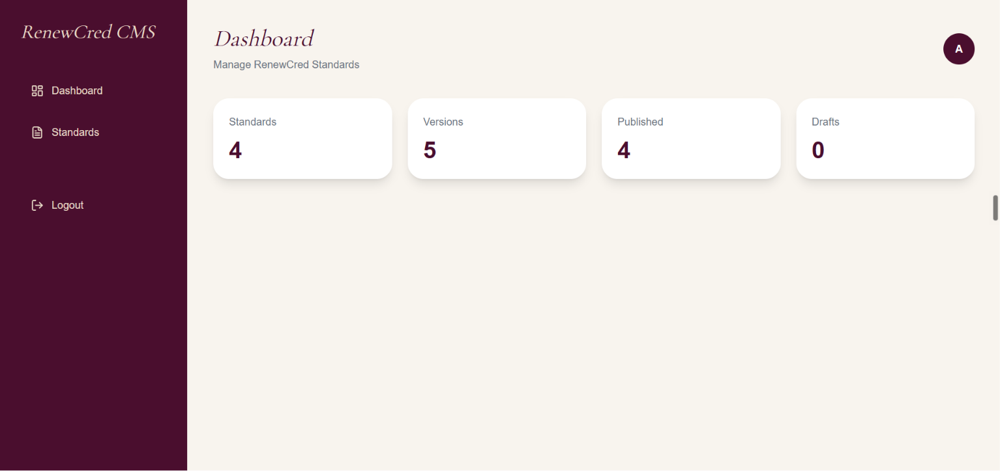

---

### Standards Management

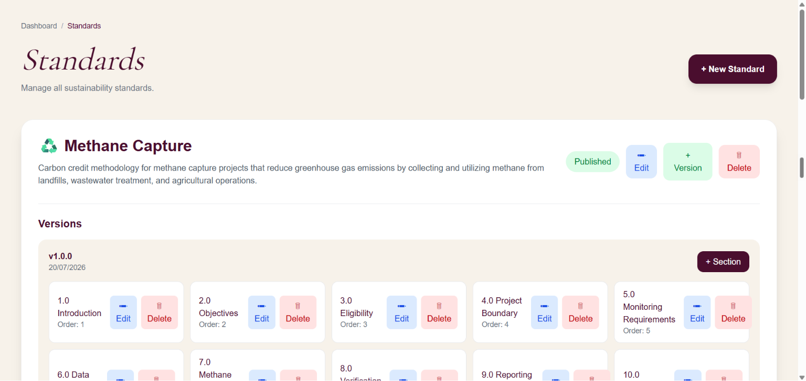
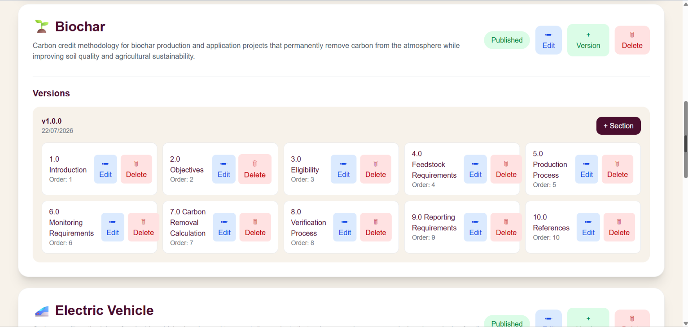
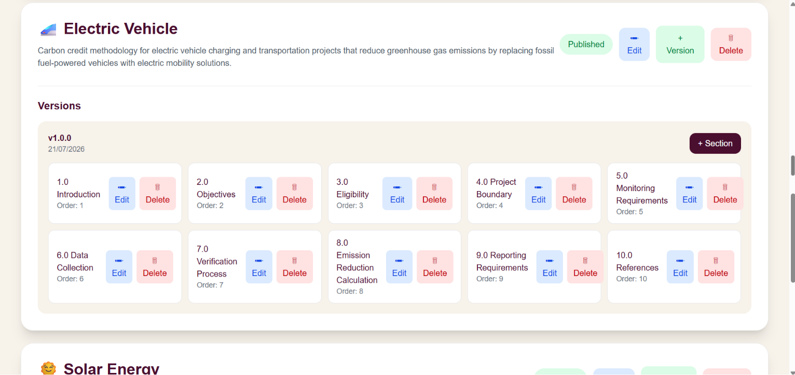
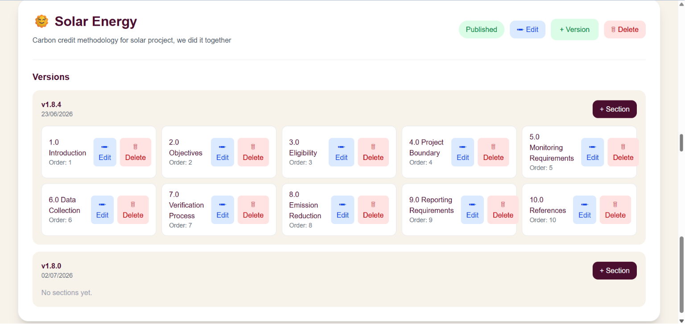

---

### Versions Management

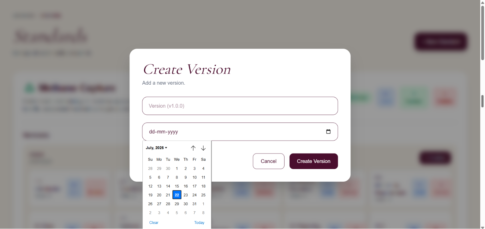

---

### Sections Management

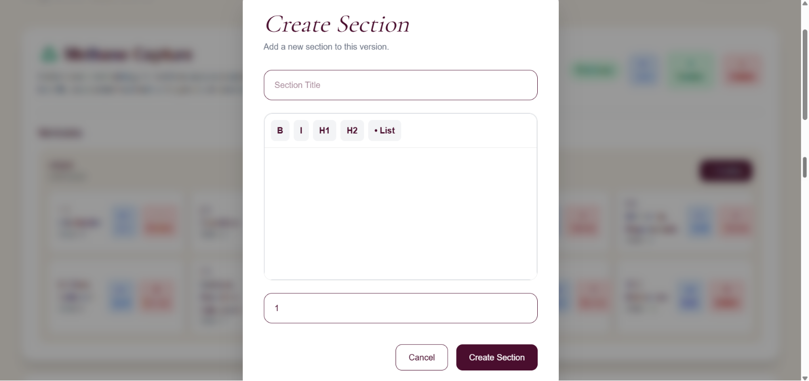
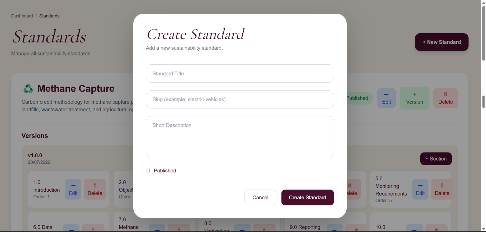
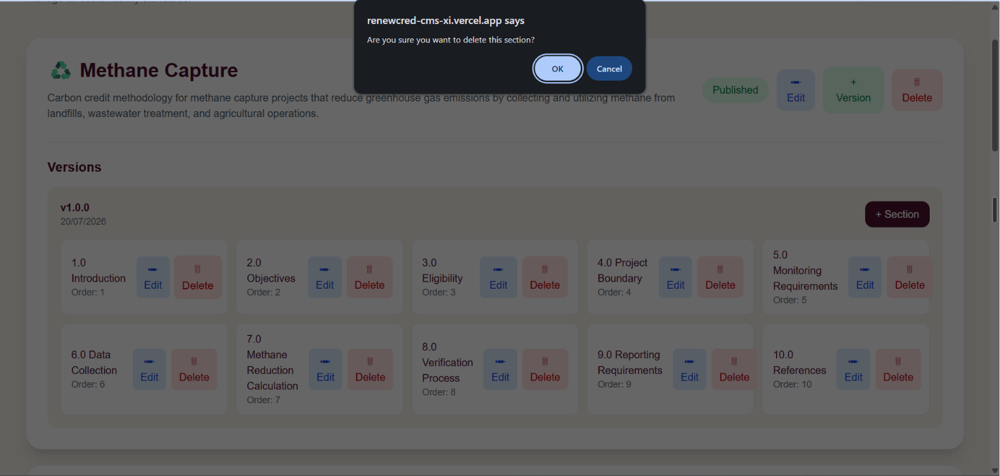
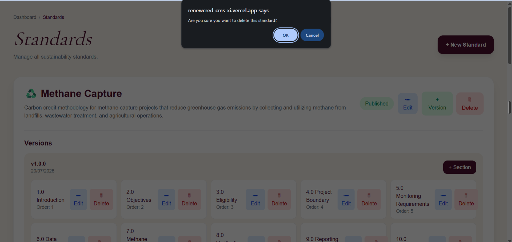


---

### Rich Text Editor

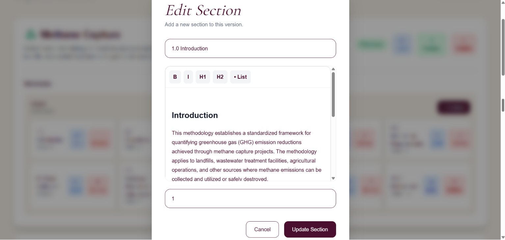
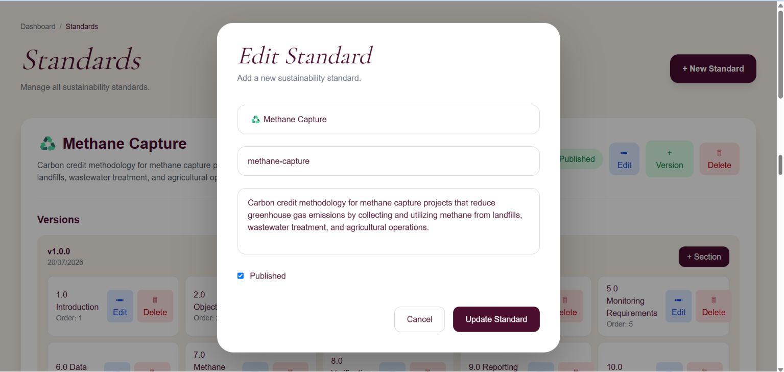

# 🔒 Authentication Flow

```
Admin Login

↓

JWT Token

↓

Protected Routes

↓

CMS Access
```

---

# 🌍 Dynamic Content Flow

```
Admin CMS

↓

MongoDB Atlas

↓

Express APIs

↓

Next.js Frontend
```

---

# 🚀 Future Improvements

- Forgot Password
- Role-Based Access Control
- Media Uploads
- Draft Version Workflow
- Content Approval Workflow
- Audit Logs
- Docker Deployment

---

# 📄 Assignment Highlights

- Full-stack CMS with JWT Authentication
- Dynamic Public Documentation Website
- Admin Dashboard for Content Management
- RESTful API Architecture
- MongoDB Atlas Integration
- Rich Text Editing using TipTap
- Versioned Documentation Support
- Responsive UI using Tailwind CSS
- Cloud Deployment (Vercel + Render)

  ---

# 🏆 Key Functionalities

✔ Authentication using JWT

✔ CRUD Operations for Standards

✔ CRUD Operations for Versions

✔ CRUD Operations for Documentation Sections

✔ Rich Text Editing

✔ Dynamic Public Website

✔ Protected Admin Routes

✔ Cloud Deployment

---

# 👨‍💻 Developer

**Ajay Sainath**

B.Tech – Computer Science & Engineering (AI & ML)

Frontend Engineering Assignment Submission

⭐ If you found this project interesting, feel free to explore the live demo and GitHub repository.
